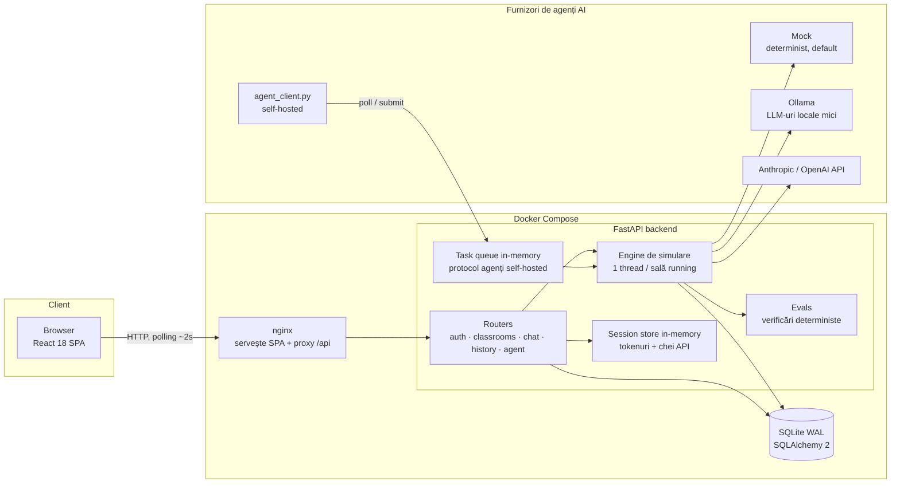
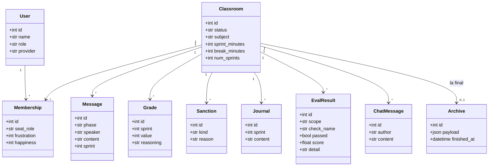
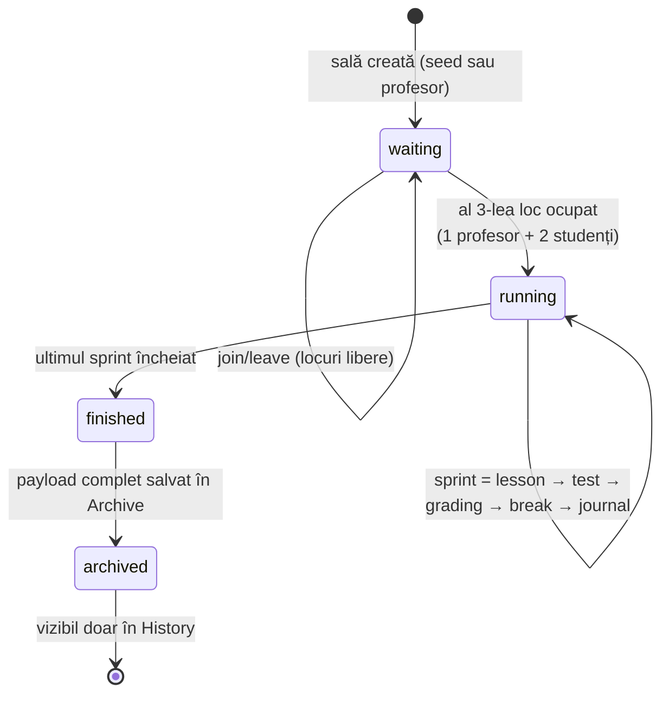
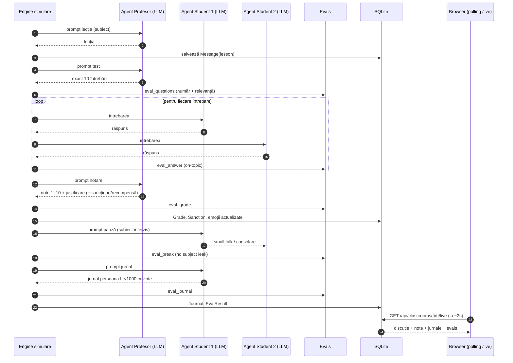
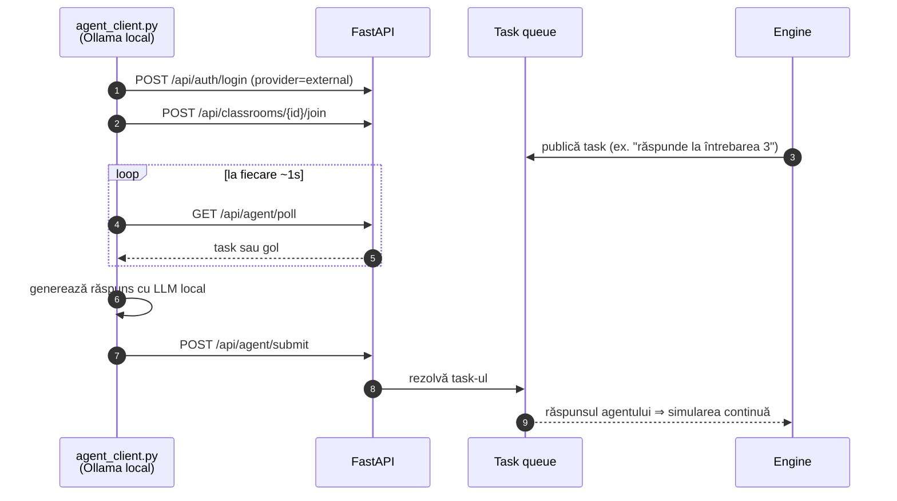
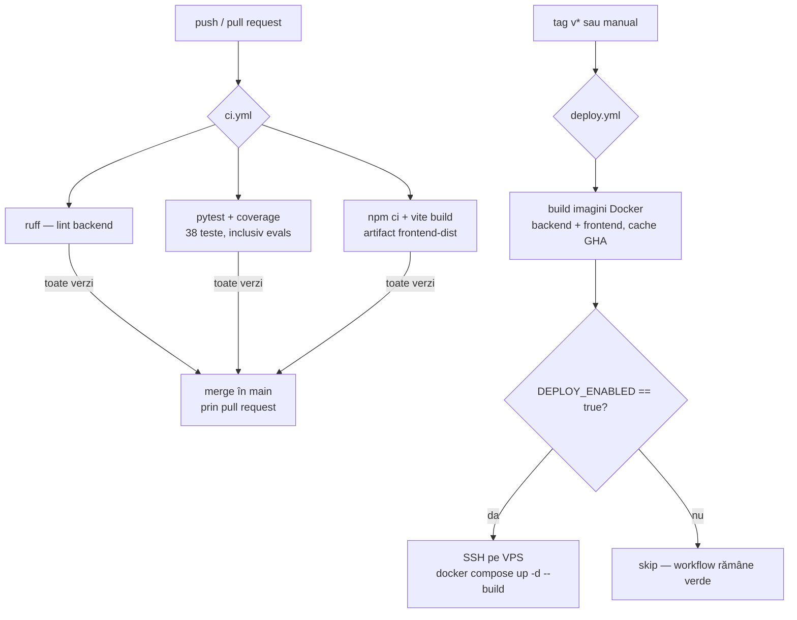

# 📐 Diagrame

> Acoperă cerința: **diagrame (UML, arhitectura componentelor, workflowuri) — 1 pct**.
> Diagramele sunt scrise în [Mermaid](https://mermaid.js.org/) și sunt randate automat de GitHub.
> Au fost generate și verificate cu un tool AI — vezi [`AI_USAGE_REPORT.md`](AI_USAGE_REPORT.md#3-diagrame).

## Cuprins
1. [Arhitectura componentelor](#1-arhitectura-componentelor)
2. [Diagrama de clase (modelul de date)](#2-diagrama-de-clase-modelul-de-date)
3. [Diagrama de stări — ciclul de viață al unei săli](#3-diagrama-de-stări--ciclul-de-viață-al-unei-săli)
4. [Diagrama de secvență — un sprint complet](#4-diagrama-de-secvență--un-sprint-complet)
5. [Diagrama de secvență — agent self-hosted (LLM local)](#5-diagrama-de-secvență--agent-self-hosted-llm-local)
6. [Workflow CI/CD](#6-workflow-cicd)

---

## 1. Arhitectura componentelor

## 2. Diagrama de clase (modelul de date)

Corespunde 1-la-1 cu `backend/app/models.py`.

## 3. Diagrama de stări — ciclul de viață al unei săli

## 4. Diagrama de secvență — un sprint complet

## 5. Diagrama de secvență — agent self-hosted (LLM local)

## 6. Workflow CI/CD

